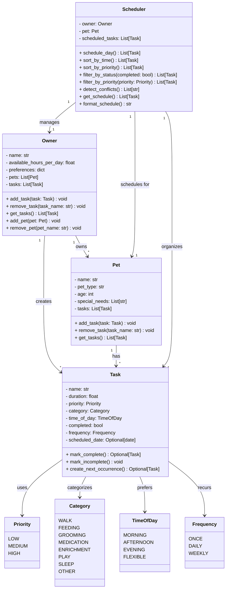

# PawPal+ System Design

## UML Class Diagram (Final Implementation)

## Class Descriptions

### Owner
Represents the pet owner who manages pets and tasks.
- Holds owner information and daily time constraints
- Can add/remove/view care tasks

### Pet
Represents a pet with basic information.
- Data holder for pet properties (name, type, age, special needs)

### Task
Represents a care task that needs to be scheduled.
- Contains task metadata (name, duration, priority, category, time preference)

### Scheduler
The core logic component that generates daily schedules.
- Takes owner, pet, and task list as input
- Produces an optimized schedule based on constraints and priorities